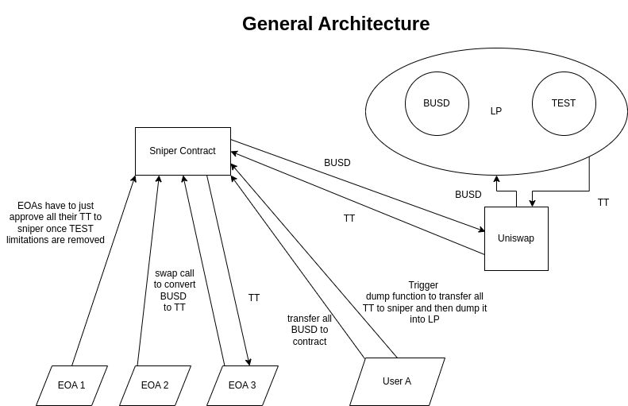

## Architecture



## Solution

You can use the tests by running

```
yarn hardhat test
```

The standalone script for running the attack is in `./scripts/Attack.ts`

The sniper contract is `./contracts/Sniper.sol`

### Sequence of events

- UserA will deposit any BUSD that they have into `Sniper.sol`
- UserA will create several burner wallets which will trigger swap function via `Sniper.sol` spending the BUSD on the contract
- After receiving the Test Token, the burner wallets should approve the entire amount for spending via `Sniper.sol`
- Upon the limits being withdrawn post the launch, UserA can trigger a dump which will dump all of the burner wallets Test tokens.

## Problem Statement

As a DeFi trader, you've learned about a highly-anticipated token launch that is set to take place on a low gas EVM-compatible chain such as Binance Smart Chain or Polygon. The token will be available for trading on a fork of Uniswap V2. You have obtained the verified contract code before the launch.

However, the token has several anti-bot features that make it challenging to trade, such as:

- A max transaction limit
- A max wallet limit
- Blacklisting of all buyers in the first N blocks post-launch
- Transfer delays (with only one transaction per block allowed)

Your goal is to secure as much of the token's supply as possible at the launch, while avoiding taxes and blacklisting.

## Project Goal

To achieve this, you have been tasked with creating a **Sniper Bot** that will automate the process of acquiring and selling the token. The Sniper Bot will have two components:

### Sniper Contract

A Solidity smart contract with the following features:

- The ability to be used securely from multiple accounts
- Interaction with the Uniswap V2 router to buy and sell tokens
- The ability to bypass as much of the token's security features as possible
- The ability to purchase from multiple wallets simultaneously
- The ability to redistribute to a different set of wallets if needed
- A configuration to hold tokens under the max wallet limit, and the ability to dump these tokens all at once
- Protection against taxes and blacklisting

### Sniper Module

A Node.js or Python module with the following functionality:

- Monitoring of the chain for token launch events
- Management of multiple wallets and their private keys
- Interaction with the sniper contract to acquire the token's supply
- Interaction with either the sniper contract or Uniswap router to sell tokens as needed
- Gathering and display of trade statistics at the end

## Bonus Points

In addition to the above requirements, the following will be considered as bonus points:

- Simulation scripts to verify and measure the bot's performance
- Suggestions for improving the security of the ERC20 token contract
- High-quality documentation
- Use of appropriate development tools such as Hardhat and Foundry
- Any other features that can improve the bot's performance and ease of use for the trader

## Skills Tested

This project is suitable for a software engineer with experience in DeFi, and it aims to test a wide range of skills that are essential for a candidate seeking a role in the field. These skills include:

- Problem-solving abilities
- Knowledge of blockchain and the EVM
- Interfacing with other DeFi projects
- Proficiency in either Node.js or Python, including the use of multiprocessing
- Ability to write simulation scripts for decentralized systems
- Knowledge of Solidity, security, and development tools
- Ability to write high-quality documentation
- Creativity

## Estimated Time

The estimated time for this project is 4 hours, including an 1 hour system design whiteboarding round. A 2-hour extension may be optional.

## References

- Remix editor - https://remix.ethereum.org/
- Solidity docs https://docs.soliditylang.org/en/v0.8.17/
- Web3js https://docs.web3js.org/api
- Web3py https://web3py.readthedocs.io/en/v5/
- Hardhat docs https://hardhat.org/docs
- Uniswap V2 docs https://docs.uniswap.org/contracts/v2/overview
